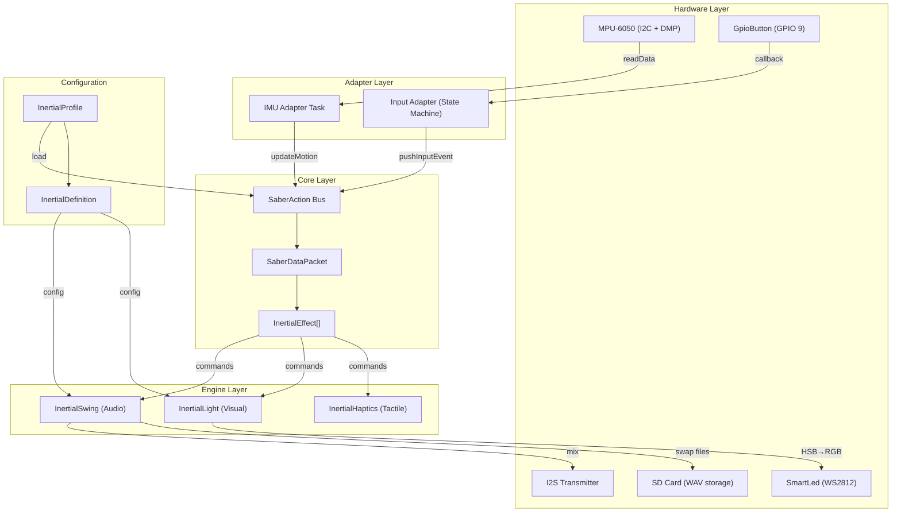
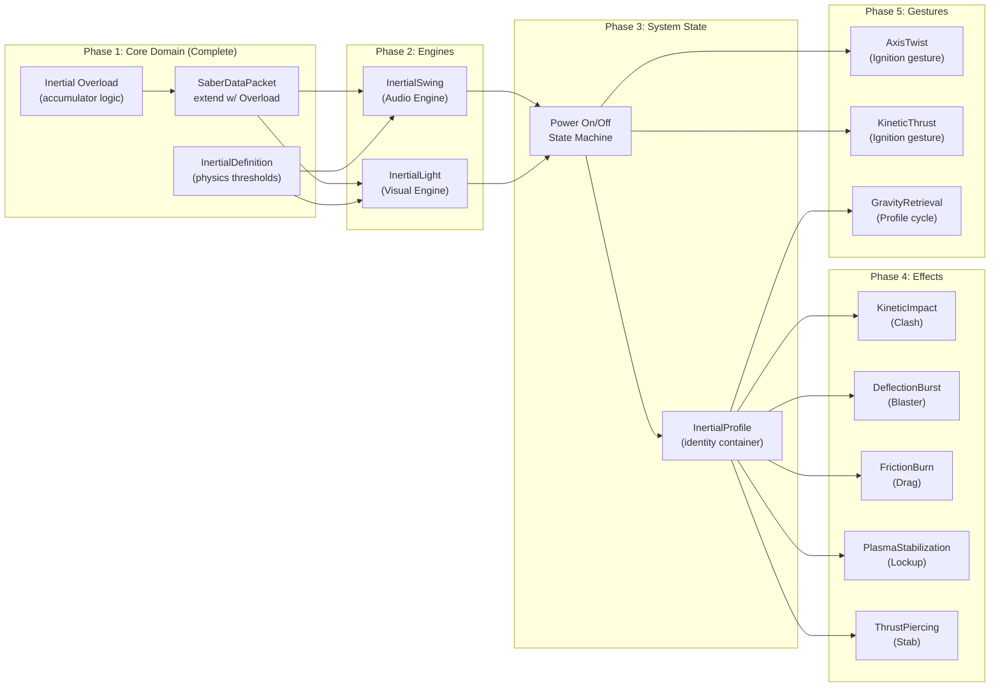

# InertialSaber OS — Project Analysis & Development Roadmap

> **This is a living document.** It tracks the architectural analysis, technical decisions,
> and development progress of the InertialSaber OS project. Update it as work progresses.

---

## How to Use This Document

### Purpose
This document is the **single source of truth** for the development roadmap. It was created after a deep analysis of the codebase against the project's wiki specifications. All major architectural decisions have been resolved and are documented in **Section 6**.

### Current Status
- **Phase 2 (Engine Implementation) is in progress.** Phase 1 is complete.
- **Target platform**: ESP32-C6 (single-core, SD-only audio). S3 optimization is deferred to Phase 6.
- The infrastructure layer (bus, packet, adapters, hardware components) is **100% complete**.
- The core physics layer (Kinetic Energy, Orientation, and Inertial Overload) is **100% complete**.
- The application layer (engines, effects, profiles, gestures) is **partially complete (~40%)**.

### Required Reading (in order)
Before starting any implementation work, read the following:

1. **Project rules and skills** — mandatory per project protocol:
   - `.agents/rules/01-project-instructions.md` (global rules, skill-first workflow)
   - `.agents/rules/00-private-rules.md` (private skills, target MCUs)
2. **This document** — architecture, decisions, and roadmap (you're reading it now)
3. **Wiki specifications** — the functional specs for what needs to be built:
   - `docs/wiki/Home.md` — system overview, 800Hz loop, data flow
   - `docs/wiki/SaberAction.md` — bus architecture, priority system, effect lifecycle
   - `docs/wiki/KineticMetrics.md` — Kinetic descriptors overview
   - `docs/wiki/InertialOverload.md` — Inertial Overload accumulator spec (Complete)
   - `docs/wiki/InertialSwing.md` — audio engine spec (Phase 2)
   - `docs/wiki/InertialLight.md` — visual engine spec (Phase 2)
   - `docs/wiki/KineticEffects.md` — discrete effects catalog (Phase 4)
   - `docs/wiki/KineticGestures.md` — gesture recognition (Phase 5)
4. **Core source files** — the integration points for new code:
   - `main/core/SaberActionBus.cpp` — the bus loop where Inertial Overload is computed
   - `main/core/SaberDataPacket.hpp` — the packet struct with InertialOverload fields
   - `main/core/InertialEffect.hpp` — the abstract effect contract (`Test()` / `Run()`)
   - `main/core/PlatformConfig.hpp` — compile-time platform constants and physics thresholds
   - `main/SaberSystem.cpp` — hardware init and adapter tasks
5. **Component spec** (for Phase 6 only):
   - `docs/development_roadmap/component_spec_memory_vfs.md` — MemoryVfs VFS driver

### Local Development Rules
1. **Local Git Review**: Before pushing or uploading changes to git, the user must review them locally.
2. **Ignored/Untracked Files Protection**: Do not modify files that are not in version control (or are excluded) without the user's explicit permission. If a change is needed, suggest it to the user for evaluation.
   - For the full list of excluded files, consult the `.gitignore` in the repository root and the `.git/info/exclude` file (local exclusions).

### Reading Order for This Document
| Section | What it tells you |
|:--------|:------------------|
| §1 Architecture | System topology, data flow, and layer boundaries |
| §2 Implementation Status | What exists vs. what's missing |
| §3 Maturity Matrix | At-a-glance completion percentages |
| §4 Dependency Graph | Build order constraints between components |
| §5 Roadmap | Phased task list with status tracking |
| §6 Decisions | All resolved architectural decisions with rationale |
| §7 Change Log | Chronological history of updates |

---

## 1. Architecture Summary

InertialSaber OS is a **physics-driven lightsaber operating system** for ESP32-S3/C6. Instead of pre-recorded animations and state machines, all sensory output (audio, visual, haptic) is a real-time mathematical function of kinetic data from an IMU.



### Core Data Flow (800Hz loop)
1. **IMU Adapter** reads DMP-processed data → computes `KineticEnergy`, `AxisRotation[3]`, `OrientationVector`
2. **Input Adapter** translates GPIO callbacks → `InputDescriptor` (state, hold duration, press count)
3. **SaberAction Bus** builds a `SaberDataPacket` snapshot each cycle
4. **InertialEffects** are evaluated: `Test(packet)` → `Run()` if triggered
5. Engines render output to I2S (audio) and LED strip (visual)

---

## 2. Current Implementation Status

### ✅ Implemented & Functional

| Component | Location | Status |
|:---|:---|:---|
| **SaberAction Bus** | `main/core/SaberActionBus.cpp` | Fully operational. Hybrid event-driven model with notification + timeout fallback. |
| **SaberDataPacket** | `main/core/SaberDataPacket.hpp` | Complete. Snapshot container for motion, input (4 slots), and inertial metrics. |
| **InertialEffect interface** | `main/core/InertialEffect.hpp` | Clean abstract contract: `Test()` / `Run()` / `Priority`. |
| **PlatformConfig** | `main/core/PlatformConfig.hpp` | Compile-time platform abstraction (S3 dual-core vs C6 single-core). Sensor filters and Inertial Overload thresholds configured. |
| **SaberSystem orchestrator** | `main/SaberSystem.cpp` | Full hardware init, IMU adapter task, button adapter with state machine, ISR routing. |
| **IMU Adapter** | Embedded in SaberSystem | DMP read → kinetic energy / rotation / orientation computation. ISR-driven with notification wake. |
| **Input Adapter** | Embedded in SaberSystem | PressDown/PressUp callbacks → InputDescriptor state machine. |
| **Inertial Overload Accumulator** | `main/core/SaberActionBus.cpp` | Physics-driven accumulator with charge/drain/burst/cooldown logic. |
| **MotionLogEffect** | `main/effects/MotionLogEffect.hpp` | Flow Modulator (Priority 0). Throttled serial logging of IMU and Overload metrics. |
| **InertialBurstLogEffect** | `main/effects/InertialBurstLogEffect.hpp` | Discrete event logger for verifying Inertial Bursts. |
| **Hardware components** | `components/` | MPU6050, GpioButton, SmartLed (with effects engine), AudioEngine + PolyphonicMixer, AudioChannel, I2sTransmitter, SdCard, RgbLed. |

### ❌ Not Yet Implemented (Specified in Wiki)

| Component | Wiki Spec | Gap Description |
|:---|:---|:---|
| **InertialSwing Engine** | `docs/wiki/InertialSwing.md` | Complete. `InertialSwingEffect` handles Crossfade, Gravity, Inertial Burst, and Zero-Volume Swap. Tuned for proper MAX98357A mixing. |
| **InertialLight Engine** | `docs/wiki/InertialLight.md` | Complete. `InertialLightEffect` implements Live Breathing, Thermal Excitation (saturation drain), and Plasma Rupture via `InertialBladeEffect` atomic bridge to SmartLed Engine. |
| **InertialHaptics Engine** | `docs/wiki/InertialHaptics.md` | Conceptual/roadmap only. No component or bus integration. |
| **Power On/Off state machine** | Wiki SaberAction | **Complete.** `PowerToggleEffect` (Priority 1) implements the full OFF→IGNITING→ON→RETRACTING→OFF state machine. Single-click ignition; double-click retraction. Synchronized audio (`in/`, `out/`) and visual sweeps (`BladeIgniteSweep`, `BladeRetractSweep`). Activates/deactivates both engines. |
| **KineticImpact (Clash)** | `docs/wiki/KineticEffects.md` | **Complete.** `KineticImpactEffect` (Priority 2) implements physical deceleration drop detection. Triggers random `clsh/*.wav` playback and complementary `BladeClashFlash` visual overlay. |
| **DeflectionBurst (Blaster)** | `docs/wiki/KineticEffects.md` | **Complete.** `BlasterEffect` (Priority 2) handles single-click trigger when saber is ON. Plays random `blst/` audio and pushes a `BladeBlasterBlock` visual overlay (random-segment white flash). |
| **FrictionBurn (Drag)** | `docs/wiki/KineticEffects.md` | Not implemented. No `InertialEffect` class exists. |
| **PlasmaStabilization (Lockup)** | `docs/wiki/KineticEffects.md` | Not implemented. No `InertialEffect` class exists. |
| **ThrustPiercing (Stab)** | `docs/wiki/KineticEffects.md` | Not implemented. No `InertialEffect` class exists. |
| **Kinetic Gestures** | `docs/wiki/KineticGestures.md` | None of the gesture patterns (Axis Twist, Kinetic Thrust, Gravity Retrieval, Force Push) are implemented. |
| **Ducking / priority rendering** | Wiki SaberAction §4.1 | Priority is assigned per effect (PowerToggle=1, Blaster=2), but the engines do not yet implement audio/visual ducking based on priority. |

---

## 3. Component Maturity Matrix

```
 Legend: ████ Complete  ▓▓▓▓ Partial  ░░░░ Not Started
 
 Infrastructure
 ├── SaberAction Bus        ████████████████  100%
 ├── SaberDataPacket        ████████████████  100%
 ├── InertialEffect iface   ████████████████  100%
 ├── PlatformConfig         ████████████████  100%
 ├── SaberSystem            ████████████████  100%
 ├── IMU Adapter            ████████████████  100%
 └── Input Adapter          ████████████████  100%
 
 Engines
 ├── InertialSwing (Audio)  ████████████████  100%
 ├── InertialLight (Visual) ████████████████  100%
 └── InertialHaptics        ░░░░░░░░░░░░░░░░    0%  (roadmap)
 
 Domain Logic
 ├── Inertial Overload      ████████████████  100%
 ├── InertialProfile        ████████████████  100%
 ├── InertialDefinition     ████████████████  100% (Centralized to PlatformConfig)
 ├── Power State Machine    ████████████████  100% (PowerToggleEffect)
 ├── Kinetic Effects (5)    ████████░░░░░░░░   40% (Blaster, Clash done; Drag, Lockup, Stab pending)
 └── Kinetic Gestures (4)   ░░░░░░░░░░░░░░░░    0%

 Hardware Components
 ├── Mpu6050 (DMP)          ████████████████  100%
 ├── GpioButton             ████████████████  100%
 ├── SmartLed               ████████████████  100%
 ├── AudioEngine + Mixer    ████████████████  100%
 ├── AudioChannel           ████████████████  100%
 ├── I2sTransmitter         ████████████████  100%
 ├── SdCard                 ████████████████  100%
 └── RgbLed                 ████████████████  100%
```

---

## 4. Dependency Graph for Development

The following shows what must be built and in what order, based on architectural dependencies:



---

## 5. Recommended Development Roadmap

### Phase 1 — Core Domain Extension (Status: ✅ COMPLETE)
> **Goal**: Add the missing kinetic metrics and configuration structures to the bus.

| # | Task | Status |
|:--|:-----|:-------|
| 1 | Add `Inertial Overload` to the bus pipeline (charge/drain/burst/cooldown logic + packet field) | ✅ Complete |
| 2 | Refactor branding to "Inertial Overload & Burst" across code and docs | ✅ Complete |

### Phase 2 — Engine Implementation
> **Goal**: Wire the hardware components to the bus via the two core engines.

| # | Task | Status |
|:--|:-----|:-------|
| 3 | Implement `InertialSwing` Flow Modulator (Crossfade + Gravity + Inertial Burst + SD Swapper) | ✅ Complete |
| 4 | Implement `InertialLight` Flow Modulator (Breathing + Thermal Excitation + Plasma Rupture) | ✅ Complete |

### Phase 3 — System State Management
> **Goal**: Add power state and the profile loading mechanism.

| # | Task | Status |
|:--|:-----|:-------|
| 5 | Implement Power State Machine (OFF → IGNITING → ON → RETRACTING → OFF) | ✅ Complete |
| 6 | Implement `InertialProfile` container (load/unload, default `inertial` profile) | ✅ Complete |

### Phase 4 — Kinetic Effects Catalog
> **Goal**: Implement the 5 discrete effects from the wiki specification.

| # | Task | Status |
|:--|:-----|:-------|
| 7 | KineticImpactEffect (Clash) — Priority 2 | ✅ Complete (`KineticImpactEffect` + `BladeClashFlash` overlay) |
| 8 | DeflectionBurstEffect (Blaster) — Priority 2 | ✅ Complete (`BlasterEffect` + `BladeBlasterBlock` overlay) |
| 9 | FrictionBurnEffect (Drag) — Priority 1 | ░░ Not Started |
| 10 | PlasmaStabilizationEffect (Lockup) — Priority 2 | ░░ Not Started |
| 11 | ThrustPiercingEffect (Stab) — Priority 1 | ░░ Not Started |

### Phase 5 — Kinetic Gestures
> **Goal**: Touchless operation via IMU pattern recognition.

| # | Task | Status |
|:--|:-----|:-------|
| 12 | AxisTwistGesture (Ignition/Retraction) | ░░ Not Started |
| 13 | KineticThrustGesture (Ignition) | ░░ Not Started |
| 14 | GravityRetrievalGesture (Profile Cycle) | ░░ Not Started |

### Phase 6 — ESP32-S3 PSRAM Optimization (Deferred)
> **Goal**: Zero-latency audio on S3 via PSRAM preloading. Not required for C6 functionality.

| # | Task | Status |
|:--|:-----|:-------|
| 15 | Implement `MemoryVfs` component (see `component_spec_memory_vfs.md`) | ░░ Not Started |
| 16 | Add PSRAM preloading logic in profile load path (gated by `CONFIG_IDF_TARGET_ESP32S3`) | ░░ Not Started |
| 17 | Validate zero-latency swap cycle on S3 hardware | ░░ Not Started |

### Development Strategy: C6-First

> All development through Phases 1–5 targets the **ESP32-C6** (single-core, no PSRAM, SD-only audio).
> The C6 protoboard is the active test platform. S3 hardware integration (Phase 6) is deferred
> until the full system is functional on C6.
>
> **Platform differences are gated by compile-time variables** (`CONFIG_IDF_TARGET_*`) in
> `PlatformConfig.hpp`. The InertialSwing engine uses SD card paths (`/sdcard/...`) on C6.
> When S3 support is added, a compile-time switch selects `/mem/` paths backed by the
> `MemoryVfs` component.

#### Zero-Volume SD Swapper — Platform Comparison

```text
ESP32-C6 (SD-only):                         ESP32-S3 (PSRAM + VFS):
────────────────────                        ──────────────────────────
1. stop(ch_swingl)                          1. stop(ch_swingl)
2. stop(ch_swingh)                          2. stop(ch_swingh)
3. play("/sdcard/.../swingl2.wav", loop, 0) 3. vfs.unregister("swingl.wav")
4. play("/sdcard/.../swingh2.wav", loop, 0) 4. vfs.unregister("swingh.wav")
                                            5. SD → PSRAM buffer (background)
                                            6. vfs.register("swingl.wav", bufA)
                                            7. vfs.register("swingh.wav", bufB)
                                            8. play("/mem/swingl.wav", loop, 0)
                                            9. play("/mem/swingh.wav", loop, 0)
```

---

## 6. Key Technical Decisions

> **Status**: 🟢 All resolved

### Decision 1: Inertial Overload Computation Location ✅
- **Resolution**: **Bus-level centralized with profile-injectable parameters.**
- Inertial Overload is computed inside `applyStagedMotion()` as a derived kinetic metric, alongside KineticEnergy and OrientationVector.
- The accumulator state (overload level, cooldown timer) lives inside `SaberActionBus`.
- `SaberDataPacket` gains two new fields: `InertialOverload` (0.0–1.0) and `InertialBurst` (bool, true for one cycle on trigger).
- The bus constants in `PlatformConfig.hpp` provide the default charge threshold, charge rate, drain rate, and burst cooldown.
- **Rationale**: The coupling cost of passing a config struct is minimal compared to the benefit of having a single source of truth visible to all engines and effects. No inter-engine dependency.

### Decision 2: Engine Threading Model ✅
- **Resolution**: **Separate FreeRTOS tasks pinned to `kEngineTaskCore`, with queue-based command dispatch from the bus.**
- On dual-core targets (ESP32-S3, ESP32): `kEngineTaskCore = 1` — InertialSwing and InertialLight get a dedicated core. Bus + events remain on Core 0.
- On single-core targets (ESP32-C6): `kEngineTaskCore = 0` — same code, same queues, shared core. FreeRTOS scheduler handles time-slicing.
- Compile-time resolution via `CONFIG_IDF_TARGET_*` macros already in `PlatformConfig.hpp`.
- Engines spawn with `xTaskCreatePinnedToCore(..., kEngineTaskCore)`. Bus communicates via FreeRTOS queues — no direct coupling.
- **Rationale**: The infrastructure (`PlatformConfig.hpp`) is already built for this. Separate tasks provide clean isolation, and the single-core fallback degrades gracefully with zero code changes.

### Decision 3: SmartLed Integration Approach ✅
- **Resolution**: **Use the existing SmartLed Engine + IEffect architecture as-is.**
- The Engine already provides: dedicated render task, base + overlay composition (up to 5 overlays), per-pixel Canvas control, `hsvToRgb()` conversion, `blend()`, global brightness, and overlay auto-removal via `isFinished()`.
- InertialLight maps directly:
  - **Base `IEffect`** → continuous states (Live Breathing + Thermal Excitation). Receives kinetic metrics, computes HSB per frame.
  - **Overlay `IEffect`** → Plasma Rupture flash. Pushed via `pushOverlay()` on `InertialBurst`, self-removes after 150ms.
- **Rationale**: No architectural limitation exists. The existing component already solves the rendering, threading, and composition problems. Replacing it would be redundant work.

### Decision 4: SD Card Audio Strategy ✅
- **Resolution**: **Use real WAV files from ProffieOS-compatible sound font libraries directly.**
- ProffieOS flat directory structure adopted for community font compatibility (`hum.wav`, `swingl/`, `swingh/`, `swng/`, `clsh/`, `blst/`, `drag/`, `lock/`, `in/`, `out/`, `force/`, etc.).
- Sound fonts already organized and available. No synthesized test tones needed.
- Each profile references a font directory by name.
- **Rationale**: Immediate access to a vast library of community sound fonts with zero conversion. The directory convention is simple, well-documented, and proven.

### Decision 5: PSRAM Audio Preloading (ESP32-S3) ✅ — *Implementation deferred to Phase 6*
- **Resolution**: **Custom VFS driver (`MemoryVfs`) that maps PSRAM buffers as virtual files. Zero changes to `AudioChannel`.**
- On ESP32-S3 (with PSRAM): at profile load time, read persistent audio files (hum, swingL/H pairs) from SD into PSRAM buffers. Register a VFS at `/mem/` that serves those buffers via standard `fopen`/`fread`/`fseek`.
- `AudioChannel.load("/mem/hum.wav", ...)` works identically to `"/sdcard/..."` — same API, same ring buffer refill logic. The difference is that `fread()` hits PSRAM (memory-to-memory, microseconds) instead of SPI (milliseconds).
- On ESP32-C6 (no PSRAM): paths stay as `/sdcard/...`, current SD-streaming model unchanged.
- One-shot effects (clash, poweron, etc.) can remain SD-backed — they're less latency-sensitive.
- Implementation: a small `MemoryVfs` component (~150 lines) implementing `esp_vfs_t`. Full spec at `component_spec_memory_vfs.md`.
- **Deferred**: All Phases 1–5 target C6 with SD-only paths. MemoryVfs and PSRAM preloading are built in Phase 6 when S3 hardware is connected.
- **Rationale**: Transparent acceleration with zero modifications to the existing audio pipeline components. The VFS abstraction is native to ESP-IDF and battle-tested.

### Audio Pipeline Architecture (Reference)
The existing audio components form a three-layer pipeline validated in the PoC:

```text
InertialSwing Effect (setChannelVolume per cycle)
    │
    ▼
AudioEngine ──── play(path, loop, vol) → ChannelId
    │             setChannelVolume(id, vol)  ← lock-free atomic
    │             stop(id) → fade-out + release
    │
    ├─ AudioChannel[0]  hum.wav      (loop, ducked)     ─┐
    ├─ AudioChannel[1]  swingl1.wav  (loop, vol=f(G))    │ Ring buffers
    ├─ AudioChannel[2]  swingh1.wav  (loop, vol=f(G))    │ 2048 samples each
    ├─ AudioChannel[3]  poweron.wav  (one-shot)          │
    ├─ AudioChannel[4]  clash.wav    (one-shot)          │
    ├─ ...up to 9 channels                              ─┘
    │
    ▼
PolyphonicMixer ── int32 accumulation → global vol → soft-clip → RMS
    │
    ▼
I2sTransmitter ── DMA double-buffer (256 frames) → 44.1kHz 16-bit mono
    │
    ▼
MAX98357A (Speaker)

Tasks:
  • mixer_task (priority 10): DMA-paced, ~172Hz mix cycles
  • sd_reader_task (priority 3): refills ring buffers on watermark
```

---

## 7. Change Log

| Date | Phase | Description |
|:-----|:------|:------------|
| 2026-05-02 | — | Initial project analysis and roadmap creation. |
| 2026-05-02 | Decision 1 | Resolved: Inertial Overload centralized in bus with profile-injectable `OverloadConfig`. |
| 2026-05-02 | Decision 2 | Resolved: Engines as separate tasks on `kEngineTaskCore`, queue-based dispatch. |
| 2026-05-02 | Decision 3 | Resolved: Use existing SmartLed Engine + IEffect architecture (base + overlay composition). |
| 2026-05-02 | Decision 4 | Resolved: Real WAV files from ProffieOS-compatible sound fonts. Community directory structure adopted. |
| 2026-05-02 | Decision 5 | Resolved: PSRAM-backed VFS (`/mem/`) for ESP32-S3. Implementation deferred to Phase 6. |
| 2026-05-02 | Strategy | C6-first development. All phases target C6 until S3 hardware is connected. |
| 2026-05-02 | Spec | `component_spec_memory_vfs.md` created for future MemoryVfs implementation. |
| 2026-05-03 | Phase 1 | **Phase 1 Complete**. Inertial Overload accumulator implemented and validated on breadboard. |
| 2026-05-03 | Branding | Standardized all legacy "TanqueOverload" terms to **Inertial Overload & Burst** in code, wiki, and roadmap. |
| 2026-05-10 | Phase 2 | **Phase 2 Audio Complete**. InertialSwing Flow Modulator implemented, hardware buttons integrated, and I2S/mixer tuning adjusted for dynamic range. |
| 2026-05-10 | Phase 2 | **Phase 2 Visual Complete**. InertialLight Flow Modulator implemented with InertialBladeEffect atomic bridge. All 3 wiki visual states functional (Breathing, Thermal Excitation, Plasma Rupture). |
| 2026-05-16 | Phase 3 | **InertialProfile Architecture Complete**. Implemented `InertialProfile` container and `InertialDefinition` POD for centralized configuration. Refactored Audio and Visual engines for dependency injection. Created default `inertial` profile. |
| 2026-05-23 | Phase 3 | **Power State Machine Complete**. `PowerToggleEffect` (Priority 1) implements the full OFF→IGNITING→ON→RETRACTING→OFF state machine with synchronized audio and visual sweep overlays (`BladeIgniteSweep`, `BladeRetractSweep`). Single-click ignition; double-click retraction. |
| 2026-05-23 | Phase 4 | **Blaster Effect Complete**. `BlasterEffect` (Priority 2) + `BladeBlasterBlock` visual overlay implemented and registered in `InertialDefaultProfile`. Triggered by single-click when saber is active. Phase 3 fully complete; Phase 4 at 1/5 (20%). |
| 2026-05-23 | Phase 4 | **Clash Effect Complete**. `KineticImpactEffect` (Priority 2) + `BladeClashFlash` visual overlay implemented and registered in `InertialDefaultProfile`. Triggered by a sudden G-force drop (> 8.0G) within a 15ms window when saber is active. Phase 4 at 2/5 (40%). |
